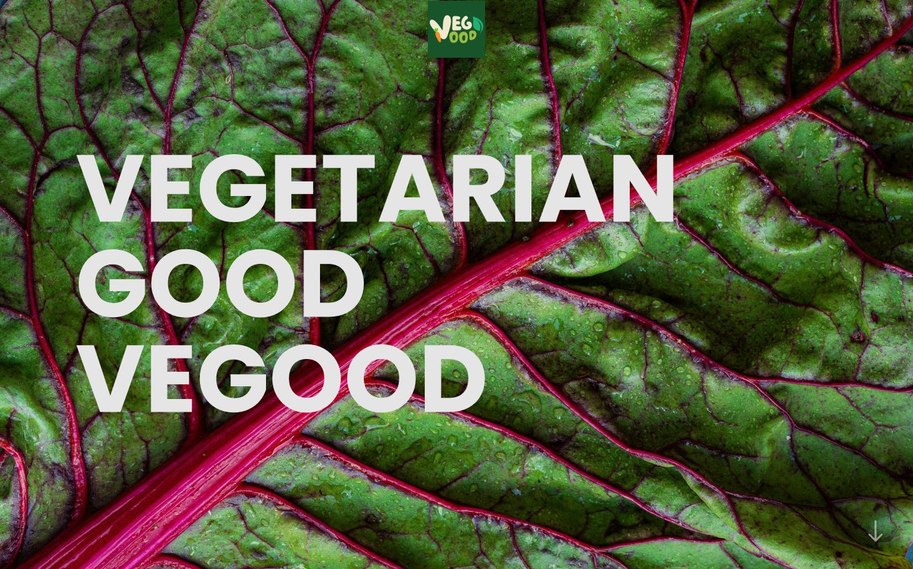

# Vegood React

Benvenuti in **Vegood React**, una piattaforma moderna per scoprire e condividere ricette vegetariane, sviluppata con **React** e **Vite**.

Per visualizzare il progetto [clicca qui](https://vegood-react.netlify.app/).

## Descrizione del Progetto

Vegood React è stato progettato per offrire un'esperienza utente fluida e intuitiva a chiunque voglia esplorare nuove ricette vegetariane. Il sito permette di sfogliare una vasta gamma di piatti, filtrare le ricette in base agli ingredienti e salvare le proprie preferite.

## Caratteristiche Principali

- 🔍 **Ricerca Avanzata**: Trova ricette in base agli ingredienti disponibili.
- 🎨 **Interfaccia Moderna**: Design accattivante e responsive per un'esperienza ottimale su qualsiasi dispositivo.
- 🚀 **Prestazioni Ottimizzate**: Grazie a Vite, il caricamento delle pagine è rapido ed efficiente.
- 📱 **Responsive Design**: Adatto a dispositivi mobili, tablet e desktop.

## Tecnologie Utilizzate

- **React**: Libreria front-end per la creazione di interfacce dinamiche.
- **Vite**: Tool moderno per lo sviluppo e il bundling delle applicazioni.
- **React Router**: Navigazione tra pagine senza ricaricare l'intero sito.
- **TailwindCSS**: Framework CSS utility-first che permette di creare interfacce utente personalizzate rapidamente senza scrivere CSS personalizzato.
- **Spoonacular API**: API dedicata al mondo della cucina, della nutrizione e delle ricette. Fornisce un'ampia gamma di funzionalità per sviluppatori che vogliono integrare nei loro progetti informazioni su cibo, ricette, valori nutrizionali e molto altro.
- **Netlify**: Piattaforma per il deployment e l'hosting di applicazioni web.

## Come Iniziare

1. **Clona il repository**:

```bash
git clone https://github.com/username/vegood-react.git
```

2. **Accedi alla cartella del progetto**:

```
cd vegood-react
```

3. **Installa le dipendenze**:

```
npm install
```

4. **Avviare un server locale:**:

```
npm run build
npm run dev
```

5. **Apri il progetto nel browser:**:

```
http://localhost:5173/
```

## Screenshot



## Contatti

Creato con ❤️ da Elisa Salvatore. Per qualsiasi domanda o suggerimento, sentiti libero di aprire un'issue o contattarmi direttamente tramite GitHub.
